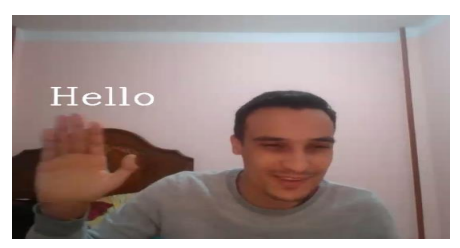
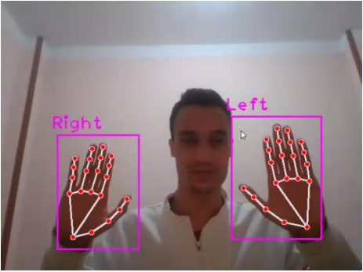

# Real_Time-sign-Language-Recognition (WORDS EDITION)
## Final Result Samples :
### Hello Sign

### Please Sign

### Telephone Sign

### Sorry Sign

## PROJECT STEPS
## DATA COLLECTION :
### Using open cv and  mediapipe_line library to detect hand using webcam :

