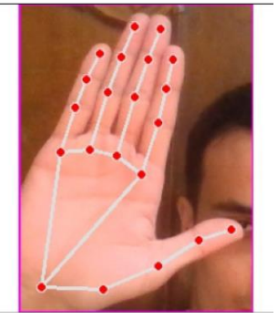
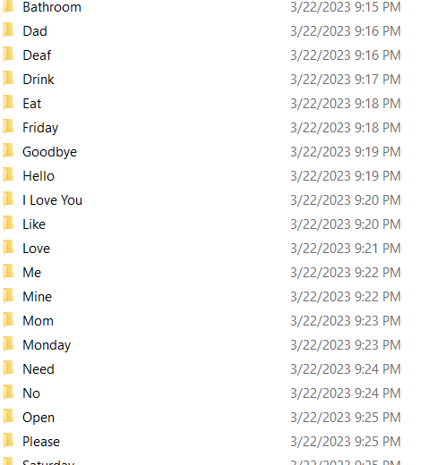

# Real-Time-sign-Language-Recognition (WORDS EDITION)

Hand gestures are a powerful way for human communication, with lots of 
potential applications in the area of human computer interaction. Vision-based
hand gesture recognition techniques have many proven advantages compared 
with traditional devices. However, hand gesture recognition is a difficult 
problem and the current work is only a small contribution towards achieving 
the results needed in the field of sign language gesture recognition. This report 
presented a vision-based system able to interpret isolated hand gestures from 
the American Sign Language (ASL)
## Final Result Samples :
### Hello Sign

### Please Sign

### Telephone Sign

### Sorry Sign

## PROJECT STEPS
## 1-DATA COLLECTION : 
### 1-Using open cv and  mediapipe library to detect hand using webcam .
#### data collection code available .

### 2- using one hand to make a sign then cropping the hand and saving to a folder named with the sign name .

### 2-LOADING DATA : using customized function to load the images and thier labels into numpy array.
### 3- spliting the data and encoding the labels.
### 4- using pre-trained vgg16 model with imagenet wieghts .
### 5- feeding the data to the model and start trainning .
### 6- high accuracy 99 to 100 % on train and validation
### 7- using open cv and mediapipe for real_time and passing the cropped photo to the model 
### 8- showing the predection without the boundary box or hand signs
# code included 
